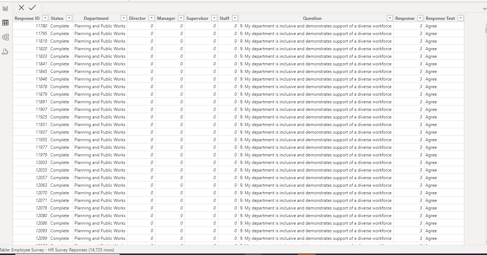
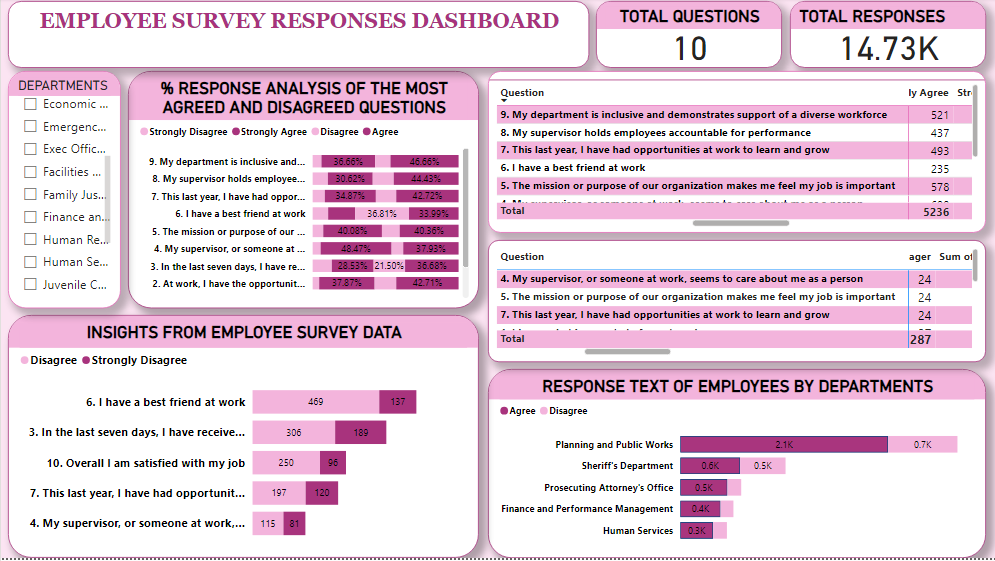

# Employee Survey Analysis

## Introduction
The Employee Survey Responses are actual responses from an employee engagement survey conducted by Pierce County WA and completed voluntarily by government employees. The dataset is a Single table and contains 14,725 records. The total number of fields is 10.

## Problem statement
1.	Which survey questions did respondents agree with or disagree with most?
2.	Do you see any patterns or trends by department or role?
3.	As an employer, what steps might you take to improve employee satisfaction based on the survey results?

Skills/ concepts demonstrated:
The following Power BI features were incorporated:
- Data cleaning,
- New measure,
- Filtering

## Visualization
The report consists of;
- Employee survey responses

You can see the Dataset here

Features:
My dashboard features include;
- Matrix
- Slicer
- Stacked bar chart
- 100% Stacked bar chart

  ## Analysis:

### Most agreed and disagreed question:
The question with the highest level of agreement is: "My department is inclusive and demonstrates support for a diverse workforce." Conversely, the question with the highest level of disagreement is: "I have a best friend at work."

### Insights from employee survey data by department and role:
The analysis shows that a significant number of managers, supervisors, and staff members agreed with the statement about inclusivity and support for diversity, with only a few expressing disagreement. Similarly, a substantial number of individuals in these roles disagreed with the statement about having a best friend at work, with just a few indicating agreement

## Employee Survey Responses Dashboard:

## Conclusion and recommendation
Based on the survey results, the organization should focus on fostering good and healthy relationships among employees. Additionally, recognizing employees for jobs well done, creating an environment where employees care about one another, and providing opportunities for learning and growth are essential steps to improve the workplace culture.😄

